```mermaid
flowchart TB
  Q["initial_prompt.md<br/>main question, verbatim"]

  subgraph INGEST["INGEST — steps 1-3 · find, curate, extract"]
    direction LR
    A1["1a planner<br/>slices the literature"] -->|"child prompts"| A2["1b searchers ×k<br/>one search thread each"]
    A2 -->|"S"| A3["1c consolidator<br/>dedupe pool + audit balance"]
    A3 -->|"S pool"| B1["2a scorers ×pool/10<br/>~10 sources each, mint D"]
    B1 -->|"S scored + D"| B2["2b selector<br/>merge D, cut to ~N curated"]
    B2 -->|"S curated"| C1["3 extractors ×N/5<br/>~5 papers each"]
    C1 -->|"O + H + A"| C2["3 consolidator<br/>merge dup D + generally-known O"]
  end

  subgraph STRUCT["STRUCTURE — steps 4-5 · cluster, link"]
    direction LR
    D1["4a merge/drop"] -->|"H active"| D2["4b cluster<br/>mints HC + residual members"]
    D2 -->|"HC"| E1["5 linkers ×cluster<br/>mint discriminating edges"]
    E1 -->|"E"| E2["5 consolidator<br/>attach args, build CG, mark orphans"]
  end

  subgraph ASSESS["ASSESS — steps 6-9 · validity, priors, likelihoods"]
    direction LR
    F1["6 argument batches<br/>&lt;=20 arguments each"] -->|"A validity"| G1["7 priors ×cluster<br/>one Prior block each"]
    G1 -->|"prior + unmarked E"| H1["8 likelihoods<br/>×CG, or ×&lt;=3 lone edges"]
    H1 -->|"Likelihood blocks"| GATE{{"gate: runner/run.py<br/>composes prior × likelihoods"}}
    GATE -->|"posterior"| I1["9 reviews ×cluster"]
  end

  subgraph ASSEMBLE["ASSEMBLE — step 10"]
    J1["10 report writer<br/>main report, 4 parts"]
  end

  Q --> A1
  C2 -->|"H"| D1
  E2 -->|"A on edges, E + CG"| F1
  I1 -->|"reviews + posterior"| J1

  linkStyle 0 stroke:#666666,stroke-width:1.5px
  linkStyle 1,2,3,4 stroke:#1f77b4,stroke-width:2px
  linkStyle 5 stroke:#2ca02c,stroke-width:2px
  linkStyle 6 stroke:#ff7f0e,stroke-width:2px
  linkStyle 7 stroke:#d62728,stroke-width:2px
  linkStyle 8 stroke:#8c564b,stroke-width:2px
  linkStyle 9 stroke:#9467bd,stroke-width:2px
  linkStyle 10 stroke:#8c564b,stroke-width:2px
  linkStyle 11 stroke:#e377c2,stroke-width:2px
  linkStyle 12 stroke:#000000,stroke-width:2.5px
  linkStyle 13 stroke:#666666,stroke-width:1.5px
  linkStyle 14 stroke:#ff7f0e,stroke-width:2px
  linkStyle 15 stroke:#9467bd,stroke-width:2px
  linkStyle 16 stroke:#000000,stroke-width:2.5px
```

**Simon Skade · FLF Epistemic Stack competition**

## Status at submission

Published now, in `analysis-tests/`: three complete end-to-end runs, one per case study, at 5–10 curated sources each (§5.1). These are **low-N shakedown runs**, not the `curated_target_N` = 25/25/50 runs §7's commands describe — I ran out of Claude usage allowance before those finished. The fuller analyses go into `analyses/` after the deadline; judges are welcome to read whichever is more useful, on the understanding that the pipeline is what's on trial. Defects these runs exposed are named in the failure-modes appendix rather than quietly patched.

## 0 — Executive summary

I built a 10-step pipeline — shipped as a Claude Code skill plus python scripts and a deterministic runner — that turns **one contested empirical question** into a typed, navigable Obsidian **knowledge graph whose Bayesian answer recomputes from the notes**. One command per case produces every file in an analysis folder, autonomously, from a single `initial_prompt.md`.

**Why it has this shape** (§1 argues it properly): a contested question rarely suffers from too little evidence, but from evidence nobody can navigate — and the usual move, counting who says what and weighting by prestige, manufactures false confidence by treating correlated sources as independent voices. So the pipeline builds its own technical model bottom-up from low-level observations instead of summarizing the debate.

**How to read the graph.** Every node is one markdown file: typed YAML frontmatter plus a prose body. Every edge is a frontmatter wikilink. So the analysis directory *is* a directed typed graph — queryable by an ordinary tool, not a narrative I ask you to trust. The answer is a **report computed over the graph**, never cached inside it; no posterior, prior or likelihood is stored in any frontmatter field, because a cached number goes stale silently and announces nothing when it does.

**The node types**, in one line each: `source` (S) a primary paper or dataset · `data-basis` (D) a shared underlying dataset, actor or instrument — observations resting on the same D are *correlated* · `observation` (O) an empirical finding or uncontested fact · `hypothesis` (H) · `hypothesis-cluster` (HC) mutually-exclusive answers to one sub-question, residual last · `argument` (A) a universally-valid inference, carrying no information of its own · `evidence-link` (E) an obs→cluster edge, minted only where the observation *discriminates* · `correlation-group` (CG) the joint-likelihood home for edges sharing a data basis. Plus one review per cluster and one main report.

**The pipeline, as four stages.** **Ingest** — find primary sources (1), score their data-reliability and map each one's data provenance (2), extract each paper's observations, hypotheses and arguments (3). **Structure** — merge and cluster hypotheses (4), mint discriminating evidence-links (5). **Assess** — judge argument validity (6), estimate priors (7) and likelihoods (8), review each cluster (9). **Assemble** — write the final report (10).

**Design philosophy, compressed:** bottom-up carving · numbers-as-variables · trust ≠ truth · correlated evidence counted once · an explicit out-of-model residual · no hand-designed human bottleneck anywhere.

### Core strengths — the delta over the baseline

Against off-the-shelf deep research or a single-prompt Claude Code investigation, five differences, in the order they matter:

1. **Correlated evidence is aggregated correctly.** Observations resting on the same data-basis get **one joint likelihood**, not one factor each. The live instance in the black-holes case: the folk "Earth and the Moon are still here despite cosmic-ray bombardment" reassurance and the Giddings–Mangano stable-black-hole exclusion argument both resolve onto the same node, `D-1 — High-energy cosmic-ray flux spectrum`. A source-counter reads two independent reassurances and gets more confident; this pipeline detects the shared basis by node identity and prices them once, as one witness. D-1's own `known_biases` line names the failure mode they share — mapping fixed-target cosmic-ray kinematics, where collision products are boosted and escape the body, onto a collider's near-symmetric kinematics. If that mapping is wrong, every argument resting on D-1 fails together. Independent-counting of correlated evidence is *the* standard way Bayesian aggregation manufactures false confidence, and it is what most separates this from a literature summary.
2. **Source-trust is separated from claim-truth**, so prestige cannot launder in. `trust_score` prices data-reliability from source features only; validity and truth are judged independently and author-blind. The verdict must stay derivable with author and venue stripped.
3. **Every number is an overridable named variable**, with its reason in the comment beside it. A skeptic re-prices any single assumption and re-runs the whole model: `--set BLOCK:var=value`.
4. **Uncertainty stays live.** Every non-exhaustive cluster carries a residual member — "the answer is something not listed here" — with its own argued weight, never `1 − sum(others)`.
5. **The output is a machine-interrogable typed graph**, not a narrative summary — so it compounds, and a consumer can take the structure without taking my numbers.

### Core weaknesses, up front

Extraction is not reproducible run-to-run: steps 1–5 are model calls, and two runs find different sources and carve at different granularity (everything downstream of the notes *is* deterministic). The trust floor can under-weight a less-published minority side. Assessment quality is capped by what ingestion recorded — steps 6–10 can only price what step 3 wrote down. Systematic counter-argument search is deprioritized: nothing actively hunts the argument no source had an incentive to make. §6 states each of these with what bounds it.

### What follows

**§1** the principles and why the method has this shape (including scalability) · **§2** the pipeline in detail, with the agent fan-out graphic · **§3** why this ontology · **§4** the Bayesian logic · **§5** the three cases and where the method strains · **§6** limitations and improvements · **§7** how to run and reproduce it.

### Provenance

Every file in each analysis folder is generated fully autonomously from that folder's `initial_prompt.md` by the single per-case command in §7, with no hand-editing; all intermediate agent notes and every retired node are kept, so what was discarded is auditable. Worked analyses: [[main report - Was the risk that LHC collisions destroy the Earth truly put to rest and what does that conclusion hinge on|black-holes]] · [[main report - Is habitual egg consumption net beneficial, harmful, or neutral for human health|eggs]] · [[main report - Did SARS-CoV-2 first infect humans through natural zoonotic spillover or through a research-related incident|covid]].

**Stated plainly:** the pipeline is implemented end to end, the runner is exercised by a passing self-check, and all three cases have run the whole way through step 10. The posteriors in §5.1 are real and recompute from the notes; they are also small-N, drawn from much larger scored pools, and I would rather you read them as a demonstration of the method than as settled answers.

A fourth analysis, the worked `sample-sahul-megafauna` demo, ships in the repo as a structurally different question run on the same schema. Its numbers are illustrative and uncalibrated, but the schema, the runner and the override machinery it exercises are the real thing — **§7 turns it into a three-command demo, including re-running the model with one assumption overridden.** If you have a terminal open, start there.

---

## 1 — Underlying principles

A contested question rarely suffers from too little evidence; it suffers from evidence nobody can navigate. The shortcut everyone reaches for — count who says what, weight by prestige, report the balance — is the one move that reliably manufactures false confidence: correlated sources get counted as independent voices, and prestige and motivated framing launder in as truth. So I did not build a summarizer over the debate. I built my own technical model of the question **bottom-up** from low-level observations, and let the debate's framings earn their place or not. The graph is the artifact; the answer is a report computed over it.

1. **Bottom-up carving.** Hypothesis clusters are built from the concrete hypotheses papers actually state and from what the observations can pull apart — step 4b forbids importing a tidy taxonomy of the debate, and step 4a's merge test is "does any curated observation in scope come out differently under these two?" Why: a top-down carving inherits the debate's own framing, including whatever rhetorical seams the participants found convenient. Where the evidence discriminates is an empirical fact about the corpus, not a fact about the argument, so it has to be discovered rather than assumed.

2. **Numbers-as-variables.** Every estimate is a named python variable with its reason in the comment beside it, inside runnable blocks in the notes; steps 7 and 8 both require the variables be sketched with their reasoning first and the values filled last. Why: three payoffs at once. Legibility — a reader disagrees with the one step I got wrong instead of with an opaque aggregate. Skeptic-override — `--set BLOCK:var=value` re-runs the whole model with one assumption re-priced. And it scales: a stronger model re-estimates one variable in place without touching the structure around it.

3. **Trust ≠ truth.** `trust_score` prices data-reliability from source features only — design, statistics, power, preregistration, independent replication, with venue and citations as a floor — and step 2 makes it the single sanctioned channel through which prestige enters the analysis at all. Claim-truth (steps 7–8) and argument-validity (step 6) are judged independently, on the merits. Why: otherwise reputation is counted twice, once as reliability and again as plausibility. The rule that enforces it: the verdict must stay derivable with author and venue stripped. Surprisingness is banned from trust for the same reason — it belongs to the prior.

4. **Correlated evidence counted once.** Observations resting on the same data-basis node get ONE joint likelihood, on a `correlation-group` node, stating P(all of them | H) jointly. Why: independent-counting of correlated evidence is *the* standard way Bayesian aggregation manufactures false confidence, and it is the technique that most separates this from a source-tally. The black-holes case gives the live instance — two apparently independent safety arguments resolving onto one cosmic-ray dataset — worked through in §4.

5. **Explicit out-of-model residual.** Every non-exhaustive cluster carries a residual member — "the answer is something not listed here" — with its own argued weight and its own real likelihood, never `1 - sum(others)`. Why: a complement is a rescaling artifact rather than an estimate, and it hides both failure modes at once. Too small and no evidence can ever lift it; too large and it soaks up every posterior. An argued weight keeps unmodelled explanations competing visibly instead of sanded off.

### Scalability

No hand-designed human bottleneck sits anywhere in the pipeline: one command per case produces every file, and the optional human-review mode is not load-bearing. The design is strictly better with stronger models and more compute — a better model re-estimates one variable in place, or extracts more carefully from the same paper, with no schema change — and more compute buys more sources, deeper extraction, and optional cross-model ensembling. Per-step model assignment is explicit in the orchestrator: the judgment-heavy children (step 1's planner and consolidator, both step-2 substeps) run on opus even when the session model is pricier, searchers run on sonnet, and every other child inherits the session model.

---

## 2 — The pipeline in detail

Ten steps, one orchestrator, which spawns every child itself. Each step fans out over disjoint slices — one child per search thread, per ~10 sources, per ~5 papers, per cluster, per ≤20 arguments, per correlation group — and each child only *adds* to the graph the previous step left. Nothing below is a human checkpoint.



*Edge colour and label name the file type flowing along it:* **S** source · **D** data-basis · **O** observation · **H** hypothesis · **HC** cluster · **A** argument · **E** evidence-link · **CG** correlation-group · **posterior** (computed, not a file). Lanes run top to bottom; agents inside a lane run left to right, and every `×k` box is a parallel fan-out over disjoint slices.


### The streams

The node types are listed in §0; what matters here is what each arrow *carries*. **S** picks up `trust_score` at step 2 — the single channel by which venue or prestige ever enters, and only as data-reliability. **D** makes "these two findings share a basis" node identity rather than matching free text, which is what makes correlation mechanically detectable at all. **O** carries findings attributed to the exact data they rest on; **H** flows un-deduplicated until step 4, where **HC** freezes the member order every later number is indexed against. **A** carries no information of its own, so it flows to whatever it attaches to — an observation (priced at step 8) or a hypothesis directly (step 7). **E** exists only where an observation discriminates, and **CG** collects the connected components of edges sharing a `D`: one group, one witness, priced once. The **posterior** is not a file at all — it is the runner composing step 7's priors with step 8's likelihoods.

### The steps

1. **1a planner** — question in, one finished child-prompt per slice out. Judgment: *how to slice*, so slices rest on independent data and every side is represented. No searcher sees the pool, so this is the only place that shape is chosen.
2. **1b searchers** — one slice in, `S` notes (~4N written, ~8N read) plus an orientation note out. Judgment: *is this the primary artifact*, not the review citing it.
3. **1c consolidator** — pool in, deduped overview + audit against 1a's plan out. Judgment: *which side or data axis came out thin* — thin triggers a top-up round.
4. **2a scorers** — ~10 source ids in; `trust_score`/`usefulness`, the `D` nodes and each source's `data_basis` out. Judgment: *would this survive a clean replication* — read off design and statistics, never off whether the conclusion seems right.
5. **2b selector** — scored pool in; duplicate `D`s merged, ~N flagged `curated`. Judgment: *the cut*, including trading a ranking point for `data_basis` independence.
6. **3 extractors** — ~5 curated papers each, read in isolation; `O`/`H`/`A` out, each resting on exactly one source. Judgment: *the observation/hypothesis line* — would a rival team analysing the same data still have to grant this?
7. **3 consolidator** — merges duplicate `D`s and near-duplicate `generally_known` observations. Judgment: *is this the same fact*. Paper-derived observations are never merged; shared data becomes correlation later.
8. **4a merge/drop** — all `H` in; near-duplicates merged, off-topic dropped. Judgment: *discriminability* — merge only where no in-scope observation would come out differently.
9. **4b cluster** — `HC` nodes, residual members and backlinks out. Judgment: *the carving* — one sub-question, exclusive answers, comparable grain.
10. **5 linkers** — one per cluster; mint an `E` only where ≥2 of the cluster's members make materially different predictions about the observation. Its one judgment is *diagnosticity*, and it mints no numbers.
11. **5 consolidator** — attaches arguments to edges via `affects_observations`, mints the `CG` nodes, orphans unlinked observations. No judgment: two scripts plus a mechanical sweep, which is the point — correlation is found, not decided.
12. **6 argument batches** — ≤20 each; out come `approved`/`corrected`/`rejected` plus `checked`/`trusted`. Judgment: *does the inference hold given its premises* — validity, not strength, not truth.
13. **7 prior children** — one per cluster; one `## Prior` python block plus `used_for_prior: true` on each edge spent. Judgment: *the partition* — which evidence is base rate (prior) and which discriminates (likelihood). Wrong either way you double-count or silently drop live evidence.
14. **8 likelihood children** — one per `CG` or per ≤3 lone edges; `## Likelihood` blocks out. Judgment: *P(obs given member)* as ratios, with `t` capped by trust. A correlated group gets one joint call, never one per observation.
15. **9 cluster reviews** — one per cluster, read-only. Judgment: *what the model cannot express*, including whether the true answer is on the list at all.
16. **10 report writer** — reviews in, one answer out. Judgment: *weighing sub-answers given in different currencies*. Written, not computed.

### Two structural facts

1. **The run is an auditable diff.** Each step adds fields and never rewrites an earlier step's; nothing is deleted. Retired nodes move to `non-curated/`, `merged/`, `dropped/`, `orphan/` with their links and content intact, so a non-curated source, a merged hypothesis and an observation that discriminated nothing are all still readable, with the reason recorded.
2. **The conclusion lives in the notes.** `runner/run.py` executes the step-7 `## Prior` and step-8 `## Likelihood` python blocks to compose each cluster's posterior — no derived number is cached in frontmatter anywhere. It is run once as a gate after step 8 and before step 9, catching a wrong-length vector, a cluster missing its prior, or a banned token before any review is written on a broken model.

---

## 3 — Why this ontology

Each node type exists because some later step has to judge it alone. An observation's data-reliability, a hypothesis's prior, and an argument's validity are three different judgments, made by three different steps (2, 7, 6), against three different rubrics. So they are three node types. Collapse any two and one step has to make two judgments in one number — which is precisely where double-counting enters, because the same intuition then gets to move the answer twice. The same test justifies the less obvious types: `data-basis` exists because "these two findings rest on the same dataset" must be node identity, not matching free text, or step 5 cannot detect correlation mechanically; `evidence-link` exists because an obs→cluster edge is minted *only where the observation discriminates*, so the edge set is itself a claim; `correlation-group` exists because a set of edges needs one shared home for a joint likelihood.

The load-bearing separation is logical validity versus empirical reliability. Step 6 asks only whether an inference holds *conditional on its premises* — assume the premises, does the conclusion follow — author-blind, with no view on whether premises or conclusion are true. Truth is priced later, as a prior (step 7) or a likelihood (step 8); mixing the two into one verdict counts the same doubt twice. The consequence is a case the pipeline gets right and a source-counter gets wrong: the ADD large-extra-dimensions proposal in the black-holes analysis yields derivations that are perfectly valid — step 6 would mark them `approved` — while the premise may simply not hold of our world. High validity, no truth-inflation; the premise's plausibility lands in the cluster prior where it can be argued and overridden. The separation runs the other way too: a motivated source's *data* can carry full `trust_score` while its selection of which arguments to present is discounted downstream.

Why it matters: prestige and motivatedness cannot launder into the conclusion, because `trust_score` is the single sanctioned channel for venue and citations and it prices data-reliability only. The verdict stays derivable with author and venue stripped. And the graph is reusable by a consumer who wants my structure but not my numbers — override the variables, re-run.

---

## 4 — The underlying Bayesian logic

Per cluster: a prior over mutually-exclusive members, times the likelihood of each discriminating observation under each member, composed by the runner into a posterior. Nothing else. Likelihoods exist only where an observation *discriminates* — where at least two members make materially different predictions. An observation every member predicts equally is left unlinked and marked `orphan`, not piled onto the winning side as "consistent with". That rule alone removes the commonest way a literature review inflates a consensus.

The anti-double-counting core is correlation. Observations resting on the same `data-basis` node get **one joint likelihood**, on a `correlation-group` node covering the whole connected component of edges sharing that basis — one `evidence()` call naming every observation, stating P(all of them | H) jointly, never a product of per-observation factors. The black-holes case has the live instance. `D-1 — High-energy cosmic-ray flux spectrum` underlies both the naive "Earth and the Moon still exist despite billions of years of cosmic-ray bombardment" argument and the Giddings–Mangano stable-black-hole exclusion. A source-counter reads two independent reassurances. The pipeline detects the shared basis by node identity and prices them once. D-1's own `known_biases` line names why that matters: the whole family depends on mapping fixed-target cosmic-ray kinematics — where products are boosted and escape the body — onto a collider's near-symmetric kinematics. If that mapping is wrong, everything resting on D-1 fails together, which is exactly what one witness means.

Every number is a named variable inside a `## Prior` or `## Likelihood` python block, with its reasoning in the comment beside it and values filled last; `--set BLOCK:var=value` re-prices any single assumption and re-runs the model. A non-exhaustive cluster carries an explicit residual member with its own argued weight, never `1 − sum(others)`.

The composition the runner implements: normalise the prior, then each edge multiplies every member by `t·lik[i] + (1−t)·marg`, where `marg` is the prior-weighted average likelihood. Equivalently, `posterior = t·(posterior at t=1) + (1−t)·prior`. So `t` is literally how far you let this evidence carry you off the prior — capped by the source's `trust_score`, argued downward for anything between the raw data and the stated observation, and zero means the edge does nothing. Because the mixture anchors on the prior rather than the running posterior, a cluster's edges commute.

---

## 5 — Case studies

I picked three questions with deliberately contrasting difficulty profiles — near-closed technical physics, a vague open-ended nutrition question, and a live politicized one — and pointed the **same command and the same case-agnostic schema** at all three, differing only in the question and `curated_target_N`. **All three have now run end-to-end through all ten steps, as preliminary shakedown runs at N=5–10 curated sources** (§5.1). Larger runs are queued.

The generalization claim does not depend on those runs finishing, and it is checkable in about thirty seconds rather than taken on trust: across the pipeline's 3053 lines of specification and code, the *only* occurrence of "black hole", "egg" or "COVID" is a single illustrative parenthetical in the skill's one-line description. There is no case-specific machinery to overfit with — the schema takes a question and an integer. A fourth, structurally different question (a Quaternary-extinction case, shipped as `sample-sahul-megafauna`) already runs the whole pipeline end to end on that same schema without a line of it changing.

The worked analyses are the real output; this section is the map, not the territory.

1. black-holes — [[main report - Was the risk that LHC collisions destroy the Earth truly put to rest and what does that conclusion hinge on|final report]]
2. eggs — [[main report - Is habitual egg consumption net beneficial, harmful, or neutral for human health|final report]]
3. covid — [[main report - Did SARS-CoV-2 first infect humans through natural zoonotic spillover or through a research-related incident|final report]]

**black-holes** (primary). *"Was the risk that LHC collisions destroy the Earth truly put to rest, and what does that conclusion hinge on?"* The consensus is not in dispute; the interesting question is what it *rests on*. That is what dependency-probing is for, and the graph makes the safety case's dependency structure explicit. The shared-data-basis machinery earns its keep immediately, collapsing two apparently independent reassurances onto the single cosmic-ray dataset `D-1` (§4). Where it strains: much of the case is specialist theoretical physics, so a large share of arguments take `reason_if_not_false: trusted` rather than `checked`. The pipeline records that honestly and step 9 flags it, but recording an unchecked derivation is not checking it.

**eggs** (second). Vague, open-ended, prone to dissolving into "same facts, different frame" — different endpoints, populations, counterfactual diets. This is the case that tests whether the method can *report that there is no strong crux*; a pipeline that always emits a confident crux is broken, not impressive. Where it strains: bottom-up carving on a question whose disagreement is framing rather than fact tends to produce clusters that are alternative partitions of the same sub-question. Step 4 forbids that explicitly — it double-counts evidence, and no `depends_on` note repairs it — but here it is a live failure mode, not a theoretical one.

**covid** (deliberately lower effort). The hardest of the three: live, high-stakes, deliberate information sabotage, heavily motivated sources on both sides, and model refusals around biorisk detail truncating what can be extracted at all. I gave it less effort by choice — it would have eaten the budget the other two needed. The `trust ≠ truth` separation is designed for exactly this shape. But motivated sources cut twice: they lower data-trust *and* bias which arguments were ever advanced, and a graph can only assess arguments that reached it. Step 9's review names that gap; it cannot fill it.

### 5.1 — Preliminary results

**Read these as shakedown runs, not as answers.** They live in `analysis-tests/`, kept deliberately separate from `analyses/`, which is where the full-N runs land after the deadline. Each case was run at `curated_target_N` = 5 (black-holes, covid) or 10 (eggs) — that is **five or ten papers, selected from a much larger scored pool**. Black-holes is representative: 23 sources scored, 18 cleared the trust baseline, the top 5 were curated. So every number below rests on a deliberately thin evidence base, and the honest reading of a small-N run is *what the pipeline does with evidence*, not *what is true about the world*. The numbers are nonetheless genuine — all ten steps ran, and every posterior recomputes from the notes via `run.py` (§7).

1. **black-holes** — HC-3 (does a hole form at all): H-8 **0.94**. HC-2 (does it evaporate): H-4 **0.956** vs non-evaporation 0.044. HC-1 (is a trapped stable hole dangerous): catastrophic H-1 **0.035**, harmless H-2 0.888, residual 0.076. Chaining the danger legs gives order **1e-4** — *my* composition, not a model output, and a loose upper shape rather than a computed probability, since the legs share `S-1` and `D-1` and are not independent. The finding that matters is not the number but the dependency structure: nearly every empirical likelihood routes through **one paper** (Giddings–Mangano, trust-capped 0.74) and its shared cosmic-ray premise `D-1`. Re-running with that trust dropped 0.74 → 0.3 moves HC-1's danger mass ×4.7.
2. **eggs** — HC-2 (net direction on hard endpoints), read by branch: **null 0.639**, direction-varies 0.308, protective 0.039, harmful 0.014. HC-1 (lipid mechanism): a real-but-saturating dietary-cholesterol effect at **0.810**. HC-3 (heterogeneity): ~0.659 on "not uniform across people". The mechanism and endpoint layers agree — a saturating lipid effect at Western baseline intake is what predicts a hard-endpoint null.
3. **covid** — one cluster only: zoonotic spillover at Huanan **0.495**, research-related incident **0.081**, neither-listed residual **0.424**.

**Where they are weak — the parts I would not defend.**

4. **Small-N curation can delete an evidence class.** Curation ranks by score with no constraint that each *class* survives. In covid this removed case geolocation and epidemiology entirely — including a source at the pool's **top** usefulness — which is much of why the residual is 42.4%. That residual is *structural*: every curated market-side observation was sampled at Huanan and every research-side one concerns the WIV, so no likelihood can discriminate against either residual leg. A fact about the observation set, not the world; the report says so rather than allocating it.
5. **covid produced a single cluster**, so cross-cluster weighing got no exercise there — black-holes (4 clusters) and eggs (3) are the only demonstrations. Its lab-leak 0.081 is not a finding either: one step-7 Fermi factor with no reference class, and defensible re-settings move it between 0.018 and 0.173.
6. **eggs' HC-2 is not a clean partition.** Three members assert a null under different scope riders, so they can co-hold and member-level ranking is undefined — the report ranks by branch and says why. HC-1's 0.810 is partly circular: the hypothesis's strongest edge comes from its own extraction source, and nothing detects that shape.
7. **black-holes covers one mechanism.** Strangelets and vacuum decay, both named in the question, never became clusters at N=5. The LSAG report itself — the document that publicly put the risk to rest — scored **below the cut** as a synthesis, so the analysis reconstructs the case from LSAG's primary inputs instead.

**What the small run did get right**, worth one paragraph because it is the obvious thing to check. The real safety case turns on the cosmic-ray argument *and its non-obvious repair*: cosmic-ray-produced holes are relativistic and escape, so Earth's survival alone says nothing about the **slow, trapped** holes the LHC would make — which is why white-dwarf and neutron-star survival is load-bearing. The graph carries both halves separately (`O-3`, `O-1`/`O-2`, `O-4`) plus the arguments joining them: `A-1` closes the relativistic-escape loophole via WD/NS stopping power, `A-2` excludes fast accretion, `A-3` excludes charged holes. `A-6` then inerts the naive Earth/Sun leg on observer-selection grounds, leaving neutron-star survival to carry the weight. Curation also caught itself about to drop the hinge — the script flagged `D-1` as shut out of the top-5 cut, and the cut was adjusted to admit the one source resting on it.

---

## 6 — Further thoughts on limitations & improvement options

**The trust floor can silence the side most worth hearing.** `combined_score = usefulness × (trust_score − baseline)`, baseline 0.8, cuts everything below baseline trust — and a contrarian position is systematically less-published, so the cut correlates with dissent rather than error. Bounded by a logged exception in step 2's cut rules: the single strongest source for an otherwise-unrepresented position may be curated even at `combined_score ≤ 0`, its unchanged low `trust_score` still discounting it in every downstream likelihood, the departure logged in `curation_reason` and `agent-notes/curation.md`. **In the shipped black-holes run this limitation fired and the exception did not save it.** Plaga's metastable-black-hole paper (`S-16`) scored `trust_score: 0.40`, `usefulness: 4.0`, `combined_score: −0.80` — high usefulness, under the floor, **cut**; so was the related `S-17` at 0.00. The result is visible in the analysis: the strongest published challenge to the accretion machinery the whole safety case rests on never entered the graph, and the report's own missing-information list names it — *"an independent, non-Giddings–Mangano computation of trapped-hole accretion engaging Plaga directly — exists, unread."* The exception clause is real but discretionary, it admits one source per position by judgment rather than by rule, and at N=5 no one invoked it. A class-coverage constraint on the cut — rather than pure score ranking — is the fix I would make first.

**Extraction is not reproducible.** Steps 1–5 are model calls; two runs of the same question find different sources and carve at different granularity. Bounded downstream: everything after the notes is deterministic — the runner is arithmetic over named variables, with `import`, `open`, `eval`, `exec` and dunder access refused inside a block, so no RNG, clock or network enters. A given graph always yields the same numbers, and two runs are diffable node-by-node. The cost: variance in the *inputs* is real and quantified nowhere.

**Assessment cannot exceed the ingestion schema.** Steps 6–10 price only what step 3 recorded. Bounded by keeping the source one hop away — every node carries `source` + `locator`, so any claim is checkable against the paper — and by "move, never delete": retired nodes go to `non-curated/`, `merged/`, `dropped/`, `orphan/`. Cost: a reader must notice the omission to repair it.

**Counter-argument search is deprioritized.** Nothing actively hunts the argument no source in the corpus had an incentive to make. Step 9 names the gap (its premortem and "motivated sources cut twice" prompts) but cannot fill it.

**The anthropic shadow is unsolved.** Survival-based safety bounds — Earth, Sun and white dwarfs still here after gigayears of cosmic-ray bombardment — are observation-selected: we could not find ourselves in the branch where the mechanism fired. The black-holes run did make the correction, and made it at the right granularity: `A-6`, sourced to Tegmark and Bostrom 2005 (`S-23`) and carrying `reason_if_not_false: checked`, holds that Earth's and the Sun's survival cannot bound the catastrophe rate at all — an observer necessarily finds themselves where catastrophe has not yet fired — *while* white dwarfs and neutron stars, observed independently of our existence, retain most of their evidential force. That distinction is what leaves neutron-star survival carrying the empirical weight after the naive Earth/Sun leg is inerted. But it entered as an argument *about* the observations, not as a schema feature: nothing in the pipeline forces the question to be asked, no field marks an observation as selection-affected, and a run whose curation missed `S-23` would have used Earth's survival at face value and never noticed.

**Improvements, by expected value.** (1) Cross-model ensembling of steps 7–8, comparing which variables move — turns limit 2 from unmeasured into measured. (2) A dedicated adversarial counter-argument pass spawned per cluster after step 5 — targets limit 4. (3) Continuous distributions and hierarchical hypotheses where a discrete mutually-exclusive cluster is a lossy fit to the question. (4) A duplicate-evidence audit after steps 5 and 8, checking that no two priced edges secretly share a basis the extraction missed: the correlated-evidence guard is only as good as the `data_basis` attribution feeding it.

---

## 7 — How to run & reproduce it

**Browse it:** `https://epistack.simonskade.org` — every typed node rendered and navigable by its frontmatter edges. The FLF iteration is frozen at `https://epistack.simonskade.org/v1/`.

**Reproduce a run:** clone `https://github.com/SimonSkade1/flf-epistack`. It ships the skill at `.claude/skills/flf-epistack/` and the worked analyses at `content/v1/analyses/<case>/`. Each case is one command:

```
cd content/v1/analyses/black-holes && claude -p "/flf-epistack 0 — curated_target_N=25" --model fable --effort max --permission-mode bypassPermissions
cd content/v1/analyses/covid       && claude -p "/flf-epistack 0 — curated_target_N=25" --model fable --effort max --permission-mode bypassPermissions
cd content/v1/analyses/eggs        && claude -p "/flf-epistack 0 — curated_target_N=50" --model fable --effort max --permission-mode bypassPermissions
```

Every file in an analysis folder is generated from that folder's `initial_prompt.md` by that one command, with no hand-editing. The folders keep all intermediate agent notes and every retired node (`non-curated/`, `merged/`, `dropped/`, `orphan/`) — nothing is deleted, so you can audit what was discarded and why.

**Interrogate the answer — a two-minute demo that runs today.** The repo ships a small fully-worked analysis, `sample-sahul-megafauna`, which exercises every step of the schema end to end. Nothing to install beyond python 3:

```
python3 .claude/skills/flf-epistack/runner/run.py content/v1/analyses/sample-sahul-megafauna
# HC-1  prior [0.2172, 0.4034, 0.2793, 0.1001]  posterior [0.2303, 0.5812, 0.115, 0.0735]  (2 evidence block(s))
```

One line per cluster, in `HC.hypotheses` order — here `[direct predation, indirect human impact, climate aridification, residual]`. Now re-price a single assumption with `--set BLOCK:var=value`, where `BLOCK` is the note's id and `var` a named variable inside its python block. `CG-1` is the correlation group holding the *one joint likelihood* for the two observations that share the `D-4` age compilation, and `t_dates` is its reliability weight:

```
python3 .claude/skills/flf-epistack/runner/run.py content/v1/analyses/sample-sahul-megafauna --set CG-1:t_dates=1.0
# posterior [0.2167, 0.6708, 0.0562, 0.0562]      <- take the compilation fully at face value
python3 .claude/skills/flf-epistack/runner/run.py content/v1/analyses/sample-sahul-megafauna --set CG-1:t_dates=0.0001
# posterior [0.2485, 0.4615, 0.1934, 0.0967]      <- distrust it entirely; collapses toward the prior
```

That is the whole claim in three commands: the conclusion is not a stored number, the correlated pair is priced once rather than twice, and any assumption a skeptic disputes is one flag away from being re-run. `t=0` recovers the prior exactly.

Once the case runs finish, the same two commands work on `content/v1/analyses/black-holes` and the other cases.

A self-check ships alongside it:

```
python3 .claude/skills/flf-epistack/runner/test_run.py
```

It rebuilds the step 7 and step 8 specs' two micro-examples as throwaway notes and asserts the runner reproduces every number those specs publish, plus determinism, edge-order commutativity, and that the sandbox guard rejects `import` inside a block. If a spec and the runner ever disagree, this fails.

**Curated entry points.** Six links, in reading order, walking from the answer down to the dataset it rests on. These point at the worked `sample-sahul-megafauna` analysis, whose numbers are illustrative; the three contest cases fill this identical skeleton, and each of their reports (§5.1) opens with its own curated entry-point list into its own graph. If you only have ten minutes, read the [[main report - Was the risk that LHC collisions destroy the Earth truly put to rest and what does that conclusion hinge on|black-holes report]] instead — it is the run where the pipeline's dependency-tracing does the most visible work.

1. [The main report](https://epistack.simonskade.org/v1/analyses/sample-sahul-megafauna/MR-1---What-drove-the-extinction-of-Sahul's-megafauna-around-45-40-ka) — the answer, its two or three reasons, and what sits outside the number.
2. [The cluster review](https://epistack.simonskade.org/v1/analyses/sample-sahul-megafauna/cluster-reviews/CR-1---Review-of-HC-1,-dominant-driver-of-the-extinction-pulse) — prose over the arithmetic: what moved the posterior, what the model cannot express, and whether the true answer is on the list at all.
3. [The cluster itself](https://epistack.simonskade.org/v1/analyses/sample-sahul-megafauna/hypothesis-clusters/HC-1---Dominant-driver-of-the-extinction-pulse) — four mutually-exclusive members, residual last, in the frozen order every likelihood vector is indexed against.
4. [The driver observation](https://epistack.simonskade.org/v1/analyses/sample-sahul-megafauna/observations/O-14---Youngest-reliable-ages-for-8-of-12-dated-genera-fall-within-~2-kyr-of-first-human-occupation) — the finding the answer leans on hardest.
5. [The correlation group](https://epistack.simonskade.org/v1/analyses/sample-sahul-megafauna/correlation-groups/CG-1---Continental-age-compilation-D-4-—-arrival-window-pattern) — **the one to read if you read one.** It holds the single joint likelihood for the two observations sharing a data basis, and its sibling edge deliberately holds no block, with a note saying why. This is the anti-double-counting rule as a file.
6. [The data basis](https://epistack.simonskade.org/v1/analyses/sample-sahul-megafauna/data-bases/D-4---Continental-late-Quaternary-age-compilation,-group-R) — the compilation both observations rest on, carrying the `known_biases` line naming the failure mode that would move both together.

Every one of these is an ordinary wikilink in a note's frontmatter; the backlinks panel on each page shows what used it.
