**Simon Skade · FLF Epistemic Stack competition**

## Status at submission

Published now, in `analysis-tests/`: three complete end-to-end runs, one per case study, at 5–10 curated sources each (§5.1). These are **low-N shakedown runs**, not the `curated_target_N` = 25/25/50 runs §7's commands describe — I ran out of Claude usage allowance before those finished. The fuller analyses go into `analyses/` after the deadline; judges are welcome to read whichever is more useful, on the understanding that the pipeline is what's on trial. Defects these runs exposed are named in the failure-modes appendix rather than quietly patched.

## 0 — Executive summary

I built a 10-step pipeline — a Claude Code skill, python scripts and a deterministic runner — that turns **one contested empirical question** into a typed, navigable Obsidian **knowledge graph whose Bayesian answer recomputes from the notes**.

**Why this shape** (§1): contested questions rarely lack evidence, they lack navigable evidence — and counting who says what, weighted by prestige, manufactures false confidence by treating correlated sources as independent voices. So the pipeline builds its own technical model bottom-up from low-level observations instead of summarizing the debate.

**How to read the graph.** Each node is one markdown file — typed YAML frontmatter plus prose; each edge is a frontmatter wikilink, so the analysis directory *is* a directed typed graph, queryable by ordinary tools. The answer is a **report computed over the graph**, never cached in it: no posterior, prior or likelihood sits in any frontmatter field, because cached numbers go stale silently.

**Node types**: `source` (`S`) primary paper or dataset · `data-basis` (`D`) shared dataset, actor or instrument — observations sharing a D are *correlated* · `observation` (`O`) empirical finding · `hypothesis` (`H`) · `hypothesis-cluster` (`HC`) mutually-exclusive answers to one sub-question, residual last · `argument` (`A`) universally-valid inference, no information of its own · `evidence-link` (`E`) obs→cluster edge, minted only where the observation *discriminates* · `correlation-group` (`CG`) joint-likelihood home for edges sharing a data basis. Plus per-cluster reviews and one main report.

**Four stages. Ingest** — find primary sources (1), score data-reliability and map provenance (2), extract observations, hypotheses and arguments (3). **Structure** — merge and cluster hypotheses (4), mint discriminating evidence-links (5). **Assess** — argument validity (6), priors (7), likelihoods (8), cluster review (9). **Assemble** — the report (10).

### Core strengths — the delta over the baseline

Against off-the-shelf deep research or a single-prompt Claude Code investigation, most important first:

1. **Correlated evidence is aggregated correctly.** Observations resting on the same data-basis get **one joint likelihood**, not one factor each. Black-holes case: the folk "Earth and the Moon are still here" reassurance and the Giddings–Mangano stable-black-hole exclusion both resolve onto `D-1 — High-energy cosmic-ray flux spectrum`. A source-counter sees two independent reassurances and gets more confident; this pipeline prices them once, as one witness. `D-1`'s `known_biases` names the failure mode they share — fixed-target cosmic-ray kinematics mapped onto a collider's near-symmetric kinematics — and if that mapping is wrong, everything resting on `D-1` fails together.
2. **Source-trust is separated from claim-truth**, so prestige cannot launder in. `trust_score` prices data-reliability from source features only; validity and truth are judged author-blind, and must stay derivable with author and venue stripped.
3. **Every number is an overridable named variable**, its reason in the comment beside it. A skeptic re-prices any assumption and re-runs the whole model: `--set BLOCK:var=value`.
4. **Uncertainty stays live.** Every non-exhaustive cluster carries a residual member — "the answer is something not listed here" — with its own argued weight, never `1 − sum(others)`.

### Core weaknesses, up front

Extraction is not reproducible run-to-run: steps 1–5 are model calls, so two runs find different sources and carve at different granularity (everything downstream of the notes *is* deterministic). The trust floor can under-weight a less-published minority side. Assessment is capped by ingestion — steps 6–10 only price what step 3 wrote down — and nothing hunts the counter-argument no source had an incentive to make. §6 bounds each of these.

### Provenance

Every file in each analysis folder is generated autonomously from that folder's `initial_prompt.md` by the single per-case command in §7, with no hand-editing; retired nodes and intermediate agent notes are kept, so discards are auditable. Worked analyses: [[main report - Was the risk that LHC collisions destroy the Earth truly put to rest and what does that conclusion hinge on|black-holes]] · [[main report - Is habitual egg consumption net beneficial, harmful, or neutral for human health|eggs]] · [[main report - Did SARS-CoV-2 first infect humans through natural zoonotic spillover or through a research-related incident|covid]].

**Stated plainly:** the pipeline is implemented end to end, the runner passes a self-check, and all three cases have run the whole way through step 10 as low-N shakedown runs. The posteriors in §5.1 are real and recompute from the notes; they are also small-N, drawn from much larger scored pools — read them as a demonstration of the method, not as settled answers.

The `sample-sahul-megafauna` demo ships in the repo: a structurally different question on the same schema, its numbers illustrative and uncalibrated but the schema, runner and override machinery the real thing — **§7 turns it into a three-command demo, including re-running the model with one assumption overridden.** If you have a terminal open, start there.

---

## 1 — Underlying principles

A contested question rarely suffers from too little evidence, but from evidence nobody can navigate. The usual shortcut (count who says what, weight by prestige) manufactures false confidence: correlated sources count as independent voices, prestige and motivated framing launder in as truth. Instead of summarizing the debate, I modelled the question **bottom-up** from low-level observations, letting its framings earn their place or not. The graph is the artifact; the answer is a report computed over it.

1. **Bottom-up carving.** Hypothesis clusters come from what papers state and what observations can pull apart: step 4b forbids importing a tidy taxonomy of the debate, and step 4a's merge test is "does any curated observation in scope come out differently under these two?" Why: top-down carving inherits the debate's framing and its rhetorical seams; where the evidence discriminates is a fact about the corpus, not the argument, so it must be discovered.

2. **Numbers-as-variables.** Every estimate is a named python variable with its reason commented beside it, in runnable blocks in the notes; steps 7 and 8 require reasoning sketched first, values filled last. Three payoffs. Legibility: a reader disagrees with the one step I got wrong, not an opaque aggregate. Skeptic-override: `--set BLOCK:var=value` re-runs the whole model with one assumption re-priced. Scaling: a stronger model re-estimates one variable in place without touching surrounding structure.

3. **Trust ≠ truth.** `trust_score` prices data-reliability from source features only (design, statistics, power, preregistration, independent replication, venue and citations only as a floor), and step 2 makes it prestige's only sanctioned channel. Claim-truth (steps 7–8) and argument-validity (step 6) are judged independently. Otherwise reputation counts twice: as reliability, then again as plausibility. Enforcement: the verdict must stay derivable with author and venue stripped. Surprisingness is banned from trust too; it belongs to the prior.

4. **Correlated evidence counted once.** Observations resting on the same data-basis node get ONE joint likelihood on a `correlation-group` node, stating P(all of them | H). Why: independent-counting of correlated evidence is *the* standard way Bayesian aggregation manufactures false confidence, and what most separates this from a source-tally. Live instance in §4: two apparently independent black-hole safety arguments on one cosmic-ray dataset.

5. **Explicit out-of-model residual.** Every non-exhaustive cluster carries a residual member ("something not listed here") with its own argued weight and real likelihood, never `1 - sum(others)`. Why: a complement is a rescaling artifact, not an estimate, and hides both failure modes. Too small and no evidence can lift it; too large and it soaks up every posterior. An argued weight keeps unmodelled explanations visibly competing.

### Scalability

No hand-designed human bottleneck sits anywhere: one command per case produces every file; the optional human-review mode is not load-bearing. The design improves with stronger models and more compute: better models re-estimate variables in place or extract more carefully, no schema change; more compute buys more sources, deeper extraction, optional cross-model ensembling. The orchestrator assigns models per step: judgment-heavy children (step 1's planner and consolidator, both step-2 substeps) run on opus, searchers on sonnet, others inherit the session model.

---

## 2 — The pipeline in detail

Ten steps, one orchestrator spawning every child. Each step fans out over disjoint slices — one child per search thread, per ~10 sources, per ~5 papers, per cluster, per ≤20 arguments, per correlation group — each child only *adds* to the previous step's graph. No human checkpoints.

```mermaid
flowchart TB
  Q["initial_prompt.md<br/>main question, verbatim"]

  subgraph INGEST["INGEST — steps 1-3 · find, curate, extract"]
    direction LR
    A1["1a planner<br/>slices the literature"] -->|"child prompts"| A2["1b searchers ×k<br/>one search thread each"]
    A2 -->|"S"| A3["1c consolidator<br/>dedupe pool + audit balance"]
    A3 -->|"S pool"| B1["2a scorers ×pool/10<br/>~10 sources each, mint D"]
    B1 -->|"S scored + D"| B2["2b selector<br/>merge D, cut to ~N curated"]
    B2 -->|"S curated"| C1["3 extractors ×N/5<br/>~5 papers each"]
    C1 -->|"O + H + A"| C2["3 consolidator<br/>merge dup D + generally-known O"]
  end

  subgraph STRUCT["STRUCTURE — steps 4-5 · cluster, link"]
    direction LR
    D1["4a merge/drop"] -->|"H active"| D2["4b cluster<br/>mints HC + residual members"]
    D2 -->|"HC"| E1["5 linkers ×cluster<br/>mint discriminating edges"]
    E1 -->|"E"| E2["5 consolidator<br/>attach args, build CG, mark orphans"]
  end

  subgraph ASSESS["ASSESS — steps 6-9 · validity, priors, likelihoods"]
    direction LR
    F1["6 argument batches<br/>&lt;=20 arguments each"] -->|"A validity"| G1["7 priors ×cluster<br/>one Prior block each"]
    G1 -->|"prior + unmarked E"| H1["8 likelihoods<br/>×CG, or ×&lt;=3 lone edges"]
    H1 -->|"Likelihood blocks"| GATE{{"gate: runner/run.py<br/>composes prior × likelihoods"}}
    GATE -->|"posterior"| I1["9 reviews ×cluster"]
  end

  subgraph ASSEMBLE["ASSEMBLE — step 10"]
    J1["10 report writer<br/>main report, 4 parts"]
  end

  Q --> A1
  C2 -->|"H"| D1
  E2 -->|"A on edges, E + CG"| F1
  I1 -->|"reviews + posterior"| J1

  linkStyle 0 stroke:#666666,stroke-width:1.5px
  linkStyle 1,2,3,4 stroke:#1f77b4,stroke-width:2px
  linkStyle 5 stroke:#2ca02c,stroke-width:2px
  linkStyle 6 stroke:#ff7f0e,stroke-width:2px
  linkStyle 7 stroke:#d62728,stroke-width:2px
  linkStyle 8 stroke:#8c564b,stroke-width:2px
  linkStyle 9 stroke:#9467bd,stroke-width:2px
  linkStyle 10 stroke:#8c564b,stroke-width:2px
  linkStyle 11 stroke:#e377c2,stroke-width:2px
  linkStyle 12 stroke:#000000,stroke-width:2.5px
  linkStyle 13 stroke:#666666,stroke-width:1.5px
  linkStyle 14 stroke:#ff7f0e,stroke-width:2px
  linkStyle 15 stroke:#9467bd,stroke-width:2px
  linkStyle 16 stroke:#000000,stroke-width:2.5px
```



*Edge colour and label name the file type:* **S** source · **D** data-basis · **O** observation · **H** hypothesis · **HC** cluster · **A** argument · **E** evidence-link · **CG** correlation-group · **posterior** (computed, not a file).


### The streams

Beyond §0's node types: **D** makes "these two findings share a basis" node identity rather than free-text matching, which makes correlation mechanically detectable. **CG** is the connected components of edges sharing a `D` — one group, one witness, priced once.

### The steps

1. **1a planner** — one child-prompt per slice. Judgment: *how to slice* — independent data per slice, every side represented.
2. **1b searchers** — `S` notes (~4N written, ~8N read) plus an orientation note. Judgment: *the primary artifact, not the review citing it*.
3. **1c consolidator** — deduped pool, audited against 1a's plan; a thin side or data axis triggers a top-up round.
4. **2a scorers** — mint `trust_score`/`usefulness`, `D` nodes and each source's `data_basis`. Judgment: *would this survive a clean replication*, from design and statistics.
5. **2b selector** — duplicate `D`s merged, ~N flagged `curated`. Judgment: *the cut*, trading a ranking point for `data_basis` independence where needed.
6. **3 extractors** — ~5 papers each, read in isolation; each `O`/`H`/`A` rests on exactly one source. Judgment: *the observation/hypothesis line* — what a rival team on the same data must grant.
7. **3 consolidator** — merges duplicate `D`s and near-duplicate `generally_known` observations. Judgment: *is this the same fact*; paper-derived observations are never merged.
8. **4a merge/drop** — near-duplicate `H` merged, off-topic dropped. Judgment: *discriminability* — merge only where no in-scope observation would differ.
9. **4b cluster** — mints `HC` (freezing the member order later numbers are indexed against), residual members, backlinks. Judgment: *the carving* — one sub-question, exclusive answers, comparable grain.
10. **5 linkers** — mint an `E` only where ≥2 of a cluster's members predict the observation materially differently. Judgment: *diagnosticity*; no numbers.
11. **5 consolidator** — attaches arguments via `affects_observations`, mints the `CG` nodes, orphans unlinked observations. No judgment: two scripts plus a sweep — correlation is found, not decided.
12. **6 argument batches** — ≤20 each; `approved`/`corrected`/`rejected` plus `checked`/`trusted` out. Judgment: *does the inference hold given its premises* — validity, not strength or truth.
13. **7 prior children** — a `## Prior` python block per cluster, `used_for_prior: true` on each edge spent. Judgment: *the partition* into base-rate and discriminating evidence — erring either way double-counts or drops evidence.
14. **8 likelihood children** — `## Likelihood` blocks, one per `CG` or per ≤3 lone edges. Judgment: *P(obs given member)* as ratios, `t` capped by trust; a correlated group gets one joint call.
15. **9 cluster reviews** — one per cluster, read-only. Judgment: *what the model cannot express*, including whether the true answer is on the list.
16. **10 report writer** — reviews in, one answer out. Judgment: *weighing sub-answers given in different currencies*. Written, not computed.

### Two structural facts

1. **The run is an auditable diff.** Steps only add fields, never rewrite them; nothing is deleted. Retired nodes move to `non-curated/`, `merged/`, `dropped/`, `orphan/`, links and content intact, reason recorded.
2. **The conclusion lives in the notes.** `runner/run.py` executes the step-7 `## Prior` and step-8 `## Likelihood` python blocks to compose each cluster's posterior; no derived number is cached in frontmatter. It gates between steps 8 and 9, so no review is written on a broken model.

---

## 3 — Why this ontology

Each node type exists because some later step judges it alone. An observation's data-reliability, a hypothesis's prior, and an argument's validity are three judgments, by three steps (2, 7, 6) against three rubrics — hence three types. Collapse any two and one step makes two judgments in one number, the same intuition moving the answer twice: double-counting. The same test justifies the rest. `data-basis`: "same dataset" must be node identity, not free-text matching, or step 5 cannot detect correlation mechanically. `evidence-link`: an obs→cluster edge is minted *only where the observation discriminates*, so the edge set is itself a claim. `correlation-group`: edges need one shared home for a joint likelihood.

The load-bearing separation is logical validity versus empirical reliability. Step 6 asks only whether an inference holds *conditional on its premises* — author-blind, indifferent to their truth. Truth is priced later, as a prior (step 7) or a likelihood (step 8); merging the two counts the same doubt twice. Hence a case the pipeline gets right and a source-counter gets wrong: the ADD large-extra-dimensions proposal yields perfectly valid derivations — step 6 would mark them `approved` — though its premise may not hold of our world. No truth-inflation; that premise's plausibility lands in the cluster prior, where it can be argued and overridden. It runs both ways: a motivated source's *data* can carry full `trust_score` while its selection of arguments is discounted downstream.

The payoff: prestige and motivatedness cannot launder into the conclusion — `trust_score` is the only sanctioned channel for venue and citations, and prices data-reliability alone. The verdict stays derivable with author and venue stripped, and anyone wanting my structure but not my numbers can override the variables and re-run.

---

## 4 — The underlying Bayesian logic

Per cluster: a prior over mutually-exclusive members, times the likelihood of each discriminating observation under each member, composed by the runner into a posterior. Nothing else. Likelihoods exist only where an observation *discriminates* — at least two members predicting materially differently; one they all predict equally stays unlinked and marked `orphan`, never counted as "consistent with", the commonest way a literature review inflates consensus.

The anti-double-counting core is correlation. Observations sharing a `data-basis` node get **one joint likelihood** on a `correlation-group` node spanning the connected component of edges on that basis — one `evidence()` call naming every observation, stating P(all of them | H) jointly, never a product of per-observation factors. Live instance: `D-1 — High-energy cosmic-ray flux spectrum` underlies both the naive Earth-and-Moon-survival argument and the Giddings–Mangano stable-black-hole exclusion — two reassurances a source-counter adds up, which node identity traces to one basis and prices once. Per D-1's `known_biases`, that family depends on mapping fixed-target cosmic-ray kinematics onto a collider's near-symmetric kinematics; if the mapping is wrong, everything on D-1 fails together — which is what one witness means.

Every number is a named variable in a `## Prior` or `## Likelihood` python block, reasoning in the comment beside it, values filled last; `--set BLOCK:var=value` re-prices any assumption and re-runs. A non-exhaustive cluster carries an explicit residual member with an argued weight, never `1 − sum(others)`.

The runner's composition: normalise the prior, then each edge multiplies every member by `t·lik[i] + (1−t)·marg`, `marg` being the prior-weighted average likelihood — equivalently, `posterior = t·(posterior at t=1) + (1−t)·prior`. So `t` is how far this evidence carries you off the prior: capped by the source's `trust_score`, argued down for any gap between raw data and stated observation; zero means the edge does nothing. Anchoring on the prior, not the running posterior, makes a cluster's edges commute.

---

## 5 — Case studies

Three questions with deliberately contrasting difficulty profiles — near-closed technical physics, a vague open-ended nutrition question, and a live politicized one — got the **same command and the same case-agnostic schema**, differing only in the question and `curated_target_N`. **All three have now run end-to-end through all ten steps, as preliminary shakedown runs at N=5–10 curated sources** (§5.1); larger runs are queued.

The generalization claim is checkable in thirty seconds: across the pipeline's 3053 lines of specification and code, the *only* occurrence of "black hole", "egg" or "COVID" is one illustrative parenthetical in the skill's one-line description. A fourth, structurally different question (a Quaternary-extinction case, `sample-sahul-megafauna`) already runs the whole pipeline end to end on that schema unchanged.

1. **black-holes** (primary) — [[main report - Was the risk that LHC collisions destroy the Earth truly put to rest and what does that conclusion hinge on|final report]]. The consensus is not in dispute; what it *rests on* is. Much of the case is specialist theory, so many arguments take `reason_if_not_false: trusted` rather than `checked` — step 9 flags that, but recording an unchecked derivation is not checking it.
2. **eggs** — [[main report - Is habitual egg consumption net beneficial, harmful, or neutral for human health|final report]]. Vague, open-ended, prone to dissolving into "same facts, different frame". It tests whether the method can *report that there is no strong crux*; a pipeline that always emits a confident crux is broken, not impressive.
3. **covid** (deliberately lower effort, to spare the budget the other two needed) — [[main report - Did SARS-CoV-2 first infect humans through natural zoonotic spillover or through a research-related incident|final report]]. Live, high-stakes, with deliberate information sabotage and motivated sources on both sides. `trust ≠ truth` is built for this shape, but motivated sources cut twice — they also bias which arguments were ever advanced, and a graph can only assess arguments that reached it.

### 5.1 — Preliminary results

**Read these as shakedown runs, not as answers.** They live in `analysis-tests/`, deliberately separate from `analyses/`, where the full-N runs land after the deadline. Each ran at `curated_target_N` = 5 (black-holes, covid) or 10 (eggs), drawn from a much larger scored pool — black-holes is representative, with 23 sources scored, 18 clearing the trust baseline, the top 5 curated. Every number below rests on a deliberately thin evidence base; the honest reading is *what the pipeline does with evidence*, not *what is true about the world*. The numbers are nonetheless genuine — all ten steps ran, and every posterior recomputes from the notes via `run.py` (§7).

1. **black-holes** — HC-3 (does a hole form at all): H-8 **0.94**. HC-2 (does it evaporate): H-4 **0.956** vs non-evaporation 0.044. HC-1 (is a trapped stable hole dangerous): catastrophic H-1 **0.035**, harmless H-2 0.888, residual 0.076. Chaining the danger legs gives order **1e-4** — *my* composition, not a model output, and a loose upper shape rather than a computed probability, since the legs share `S-1` and `D-1` and are not independent. The structure matters more: nearly every empirical likelihood routes through **one paper** (Giddings–Mangano, trust-capped 0.74) and its shared cosmic-ray premise `D-1`; dropping that trust 0.74 → 0.3 moves HC-1's danger mass ×4.7.
2. **eggs** — HC-2 (net direction on hard endpoints), by branch: **null 0.639**, direction-varies 0.308, protective 0.039, harmful 0.014. HC-1 (lipid mechanism): a real-but-saturating dietary-cholesterol effect at **0.810**. HC-3 (heterogeneity): ~0.659 on "not uniform across people". Mechanism and endpoint layers agree — a saturating lipid effect at Western baseline intake predicts a hard-endpoint null.
3. **covid** — one cluster only: zoonotic spillover at Huanan **0.495**, research-related incident **0.081**, neither-listed residual **0.424**.

**Where they are weak — the parts I would not defend.**

4. **Small-N curation can delete an evidence class.** Curation ranks by score with no constraint that each *class* survives. In covid it dropped case geolocation and epidemiology entirely — including the pool's **top**-usefulness source — much of why the residual is 42.4%. That residual is *structural*: every curated market-side observation was sampled at Huanan and every research-side one concerns the WIV, so no likelihood can discriminate against either residual leg. A fact about the observation set, not the world; the report says so rather than allocating it.
5. **covid produced a single cluster**, so cross-cluster weighing got no exercise there; black-holes (4 clusters) and eggs (3) are the only demonstrations. Its lab-leak 0.081 is not a finding either: one step-7 Fermi factor with no reference class, and defensible re-settings move it between 0.018 and 0.173.
6. **eggs' HC-2 is not a clean partition.** Three members assert a null under different scope riders, so they can co-hold and member-level ranking is undefined — the report ranks by branch and says why. HC-1's 0.810 is partly circular: its strongest edge comes from its own extraction source, and nothing detects that shape.
7. **black-holes covers one mechanism.** Strangelets and vacuum decay, both named in the question, never became clusters at N=5. The LSAG report — the document that publicly put the risk to rest — scored **below the cut** as a synthesis, so the analysis reconstructs the case from LSAG's primary inputs.

**What the small run did get right.** The real safety case turns on the cosmic-ray argument *and its non-obvious repair*: cosmic-ray-produced holes are relativistic and escape, so Earth's survival alone says nothing about the **slow, trapped** holes the LHC would make — which is why white-dwarf and neutron-star survival is load-bearing. The graph carries both halves separately (`O-3`, `O-1`/`O-2`, `O-4`) plus the arguments joining them: `A-1` closes the relativistic-escape loophole via WD/NS stopping power, `A-2` excludes fast accretion, `A-3` excludes charged holes. `A-6` then inerts the naive Earth/Sun leg on observer-selection grounds, leaving neutron-star survival to carry the weight. Curation also caught itself about to drop the hinge — the script flagged `D-1` as shut out of the top-5 cut, and the cut was adjusted to admit the one source resting on it.

---
## 6 — Further thoughts on limitations & improvement options

1. **The trust floor can silence the side most worth hearing.** `combined_score = usefulness × (trust_score − baseline)`, baseline 0.8, cuts everything below baseline trust; contrarian positions are less-published, so it tracks dissent, not error. Step 2's exception clause (curate one under-floor source per unrepresented position, logged in `curation_reason` and `agent-notes/curation.md`) is discretionary, and at N=5 no one invoked it. **It fired in the shipped run:** Plaga's metastable-black-hole paper (`S-16`) — `trust_score: 0.40`, `usefulness: 4.0`, `combined_score: −0.80` — sat under the floor and was **cut**, as was `S-17` at 0.00, so the strongest published challenge to the accretion machinery never entered the graph. Fix: class-coverage constraint, not score ranking.
2. **Extraction is not reproducible.** Steps 1–5 are model calls; two runs find different sources and carve at different granularity. Downstream is deterministic (arithmetic over named variables; `import`, `open`, `eval`, `exec` and dunder access refused), but variance in the *inputs* is quantified nowhere.
3. **Assessment cannot exceed the ingestion schema.** Steps 6–10 price only what step 3 recorded. Bounded by `source` + `locator` on every node and by "move, never delete" (`non-curated/`, `merged/`, `dropped/`, `orphan/`), but the reader must notice the omission to repair it.
4. **Counter-argument search is deprioritized.** Nothing hunts the argument no source had an incentive to make; step 9 names the gap but cannot fill it.
5. **The anthropic shadow is unsolved.** Survival-based bounds are observation-selected — we could not observe the branch where the mechanism fired. The run corrected this: `A-6`, sourced to Tegmark and Bostrom 2005 (`S-23`) and carrying `reason_if_not_false: checked`, holds Earth's and the Sun's survival cannot bound the catastrophe rate at all, *while* white dwarfs and neutron stars, observed independently of us, retain most of their evidential force. But that entered as an argument, not a schema feature: no field marks an observation as selection-affected, and a run missing `S-23` would have used Earth's survival unchecked.

**Improvements, by expected value.** (1) Cross-model ensembling of steps 7–8 — measures limit 2. (2) An adversarial counter-argument pass per cluster after step 5 — targets limit 4. (3) Continuous distributions and hierarchical hypotheses where discrete clusters fit badly. (4) A duplicate-evidence audit after steps 5 and 8; the correlated-evidence guard is only as good as its `data_basis` attribution.

---

## 7 — How to run & reproduce it

**Browse it:** `https://epistack.simonskade.org` — every typed node rendered and navigable by its frontmatter edges; the FLF iteration is frozen at `https://epistack.simonskade.org/v1/`.

**Reproduce a run:** clone `https://github.com/SimonSkade1/flf-epistack`. It ships the skill at `.claude/skills/flf-epistack/` and the worked analyses at `content/v1/analyses/<case>/`. Each case is one command:

```
cd content/v1/analyses/black-holes && claude -p "/flf-epistack 0 — curated_target_N=25" --model fable --effort max --permission-mode bypassPermissions
cd content/v1/analyses/covid       && claude -p "/flf-epistack 0 — curated_target_N=25" --model fable --effort max --permission-mode bypassPermissions
cd content/v1/analyses/eggs        && claude -p "/flf-epistack 0 — curated_target_N=50" --model fable --effort max --permission-mode bypassPermissions
```

Every file in an analysis folder comes from its `initial_prompt.md` via that command, no hand-editing. Retired nodes stay in place (`non-curated/`, `merged/`, `dropped/`, `orphan/`), so discards stay auditable.

**Interrogate the answer — a two-minute demo.** The repo ships `sample-sahul-megafauna`, a fully-worked analysis exercising every schema step. Needs only python 3:

```
python3 .claude/skills/flf-epistack/runner/run.py content/v1/analyses/sample-sahul-megafauna
# HC-1  prior [0.2172, 0.4034, 0.2793, 0.1001]  posterior [0.2303, 0.5812, 0.115, 0.0735]  (2 evidence block(s))
```

One line per cluster, in `HC.hypotheses` order — here `[direct predation, indirect human impact, climate aridification, residual]`. Re-price any assumption with `--set BLOCK:var=value`: `BLOCK` is a note id, `var` a named variable in its python block. `CG-1` holds the *one joint likelihood* for the two observations sharing the `D-4` age compilation; `t_dates` is its reliability weight:

```
python3 .claude/skills/flf-epistack/runner/run.py content/v1/analyses/sample-sahul-megafauna --set CG-1:t_dates=1.0
# posterior [0.2167, 0.6708, 0.0562, 0.0562]      <- take the compilation fully at face value
python3 .claude/skills/flf-epistack/runner/run.py content/v1/analyses/sample-sahul-megafauna --set CG-1:t_dates=0.0001
# posterior [0.2485, 0.4615, 0.1934, 0.0967]      <- distrust it entirely; collapses toward the prior
```

The conclusion is not a stored number: any disputed assumption is one flag from a re-run. `t=0` recovers the prior exactly.

Once the case runs finish, the same commands work on `content/v1/analyses/black-holes` and the others.

Self-check:

```
python3 .claude/skills/flf-epistack/runner/test_run.py
```

It rebuilds the step 7 and step 8 specs' micro-examples and asserts the runner reproduces every number they publish, plus determinism, edge-order commutativity, and the sandbox guard rejecting `import`. It fails if a spec and the runner disagree.

**Curated entry points.** Six links in reading order, answer down to dataset, into `sample-sahul-megafauna`; its numbers are illustrative, the contest cases fill the same skeleton (each report, §5.1, has its own list). With ten minutes, read the [[main report - Was the risk that LHC collisions destroy the Earth truly put to rest and what does that conclusion hinge on|black-holes report]] instead — its dependency-tracing is most visible.

1. [The main report](https://epistack.simonskade.org/v1/analyses/sample-sahul-megafauna/MR-1---What-drove-the-extinction-of-Sahul's-megafauna-around-45-40-ka) — the answer, and what sits outside it.
2. [The cluster review](https://epistack.simonskade.org/v1/analyses/sample-sahul-megafauna/cluster-reviews/CR-1---Review-of-HC-1,-dominant-driver-of-the-extinction-pulse) — what moved the posterior, and whether the true answer is listed.
3. [The cluster itself](https://epistack.simonskade.org/v1/analyses/sample-sahul-megafauna/hypothesis-clusters/HC-1---Dominant-driver-of-the-extinction-pulse) — four mutually-exclusive members, residual last, in the frozen index order.
4. [The driver observation](https://epistack.simonskade.org/v1/analyses/sample-sahul-megafauna/observations/O-14---Youngest-reliable-ages-for-8-of-12-dated-genera-fall-within-~2-kyr-of-first-human-occupation) — the finding the answer leans on hardest.
5. [The correlation group](https://epistack.simonskade.org/v1/analyses/sample-sahul-megafauna/correlation-groups/CG-1---Continental-age-compilation-D-4-—-arrival-window-pattern) — **read this one if you read one.** One joint likelihood for two observations sharing a data basis; the sibling edge deliberately holds none, and says why.
6. [The data basis](https://epistack.simonskade.org/v1/analyses/sample-sahul-megafauna/data-bases/D-4---Continental-late-Quaternary-age-compilation,-group-R) — the compilation both rest on; its `known_biases` line names the shared failure mode.

Each is an ordinary frontmatter wikilink; the backlinks panel shows what used it.
